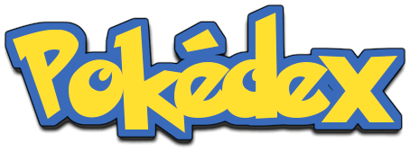
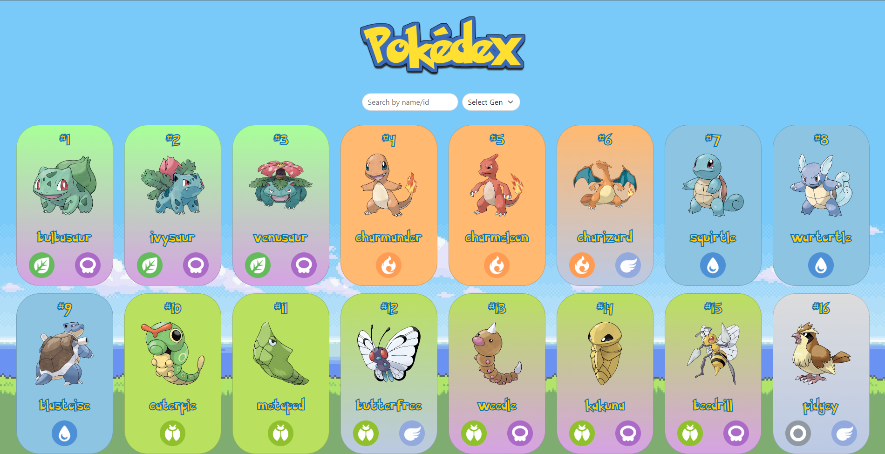
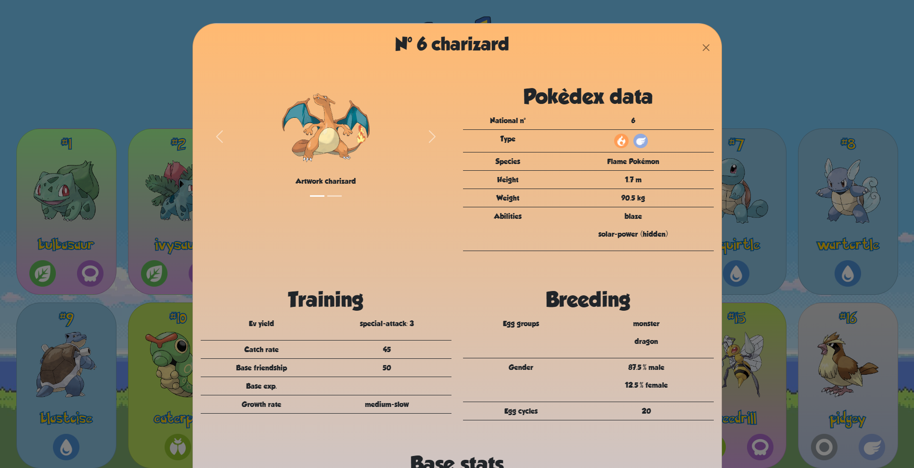

<div align="center">
  
</div>

<h1 align="center">
     
    Pokedex project create with react.js, PokèApi, Bootstrap 
    
</h1>

<p align="center">
  <a href="#about-the-project">About The Project</a> |
  <a href="#preview">Preview</a> | 
  <a href="#started">Getting Started</a> |
  <a href="#author">Author</a> |
  <a href="#license">License</a>
</p>
</br>
</br>
</br>

<h2 id="about-the-project" align="center">  About The Project </h2></br>
Web Application that simulates the pokedex.

This Web Application allows you to:
- Search for a pokemon by id or name
- View the pokemon of a specific gen
- See the information of a single pokemon
    
This web application was created by:
- [React.js](https://react.dev/) 
- [PokéAPI](https://pokeapi.co/) (pokedex-promise-v2)
- [React-Bootstrap](https://react-bootstrap.github.io/)

***You can see the first version [here](https://pokedex-tomas.netlify.app/)!***
</br>
</br>
</br>

<h2 id="preview" align="center"> Preview </h2>
</br>
 

 
</br>
</br>
</br>


<h2 id="started" align="center"> Getting Started </h2>
</br>

```bash
# Clone Repository
$ git clone https://github.com/robyx080/pokedex.git

# Go to server folder
$ cd pokedex

# Run Aplication
$ npm start

# Access localhost
http://localhost:3000
```
</br>
</br>
</br>

<h2 id="author" align="center"> 💻 Author </h2>
</br>

<div style="text-align: center;">
  

  <sub><b>Roberto Tomasello</b></sub>
  
  [](https://www.linkedin.com/in/roberto-tomasello-46427919b)

  [](mailto:robyx080@gmail.com)
</div>
</br>
</br>
</br>

<div style="text-align: center;">
  <h2 id="license"> 📝 License </h2>
  
  This project is under the [MIT](./LICENSE) license.
</div>
